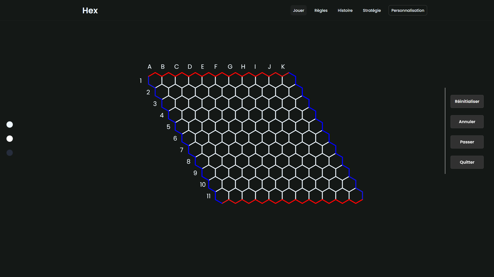
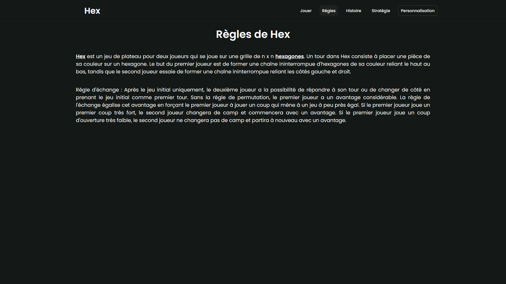
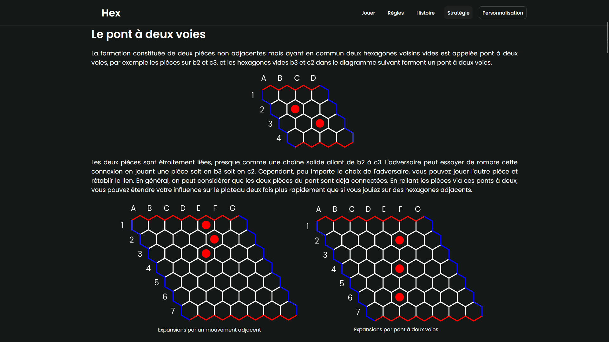
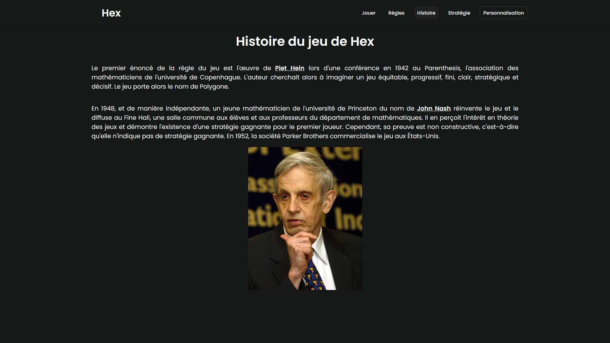
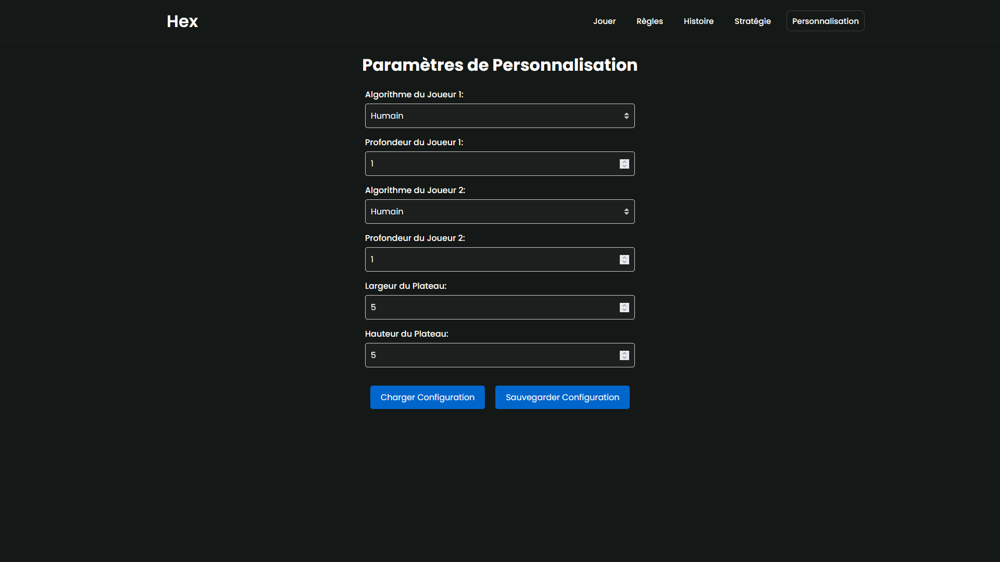

# Hex

## Description

Hex est une implémentation en Python du jeu de Hex avec une interface graphique utilisant la bibliothèque Eel. Le jeu peut être joué contre un autre joueur ou contre une IA basée sur divers algorithmes. Le jeu est entièrement personnalisable via un fichier de configuration toml.

Le projet inclut les éléments suivants :

- Le jeu de Hex de base
- Plusieurs algorithmes d'IA, incluant :
    - Minimax
    - Negamax
    - Alpha-Beta Pruning
    - SSS*
- Un fichier de configuration toml pour personnaliser le jeu
- Plusieurs thèmes graphiques
- Une interface graphique pour jouer au jeu

## Aperçu du jeu

### Partie de Hex


### Règles de Hex


### Stratégie de Hex


### Histoire du Jeu


### Personnalisation du Jeu


## Installation

Ce projet a été développé avec Python 3.10.0 et il est recommandé d'utiliser un environnement virtuel pour installer les dépendances.

1. Clonez le projet et accédez au répertoire :

```bash
git clone https://github.com/hugo-hamon/Hex-99.git
cd Hex-99
```

2. Créez un environnement virtuel et activez-le :
    
- Pour Linux et macOS :
```bash
python3 -m venv venv
source venv/bin/activate
```
- Pour Windows :
```bash
python3 -m venv venv
.\venv\Scripts\activate
```

3. Installez les dépendances nécessaires en utilisant `requirements.txt` :
```bash
pip install -r requirements.txt
```

## Utilisation

Pour lancer le jeu, exécutez le fichier `run.py` :

```bash
cd project
python run.py
```

## Configuration

Le dossier `config` contient divers fichiers de configuration prédéfinis, mais vous pouvez en créer de nouveaux ou modifier les fichiers existants selon vos besoins.

## Crédits

Ce projet a été développé par `Hamon Hugo` & `Praden Pierre`, l'interface graphique a été développée en utilisant la bibliothèque Eel.

Github : 
    - [Hugo Hamon](https://github.com/hugo-hamon)
    - [Pierre Praden](https://github.com/Pierrep02)


## License

Ce projet est sous licence MIT - voir le fichier [LICENSE](LICENSE) pour plus de détails.